# Cube Studio

cube是tme开源的一站式云原生机器学习平台，目前主要包含
 - 1、特征平台，支持在/离线特征；数据源管理，支持结构数据和媒体标注数据管理；
 - 2、在线的vscode/jupyter代码开发；在线镜像调试，支持免dockerfile，增量构建；
 - 3、任务流编排，在线拖拉拽；开放的模板市场，支持tf/pytorch/mxnet/spark/ray/horovod/kaldi/volcano等分布式计算/训练任务；task的单节点debug，分布式任务的批量优先级调度，聚合日志；任务运行资源监控，报警；定时调度，支持补录，忽略，重试，依赖，并发限制，定时任务算力的智能修正；
 - 4、nni，katib，ray的超参搜索；
 - 5、tf/pytorch/onnx模型的推理服务，serverless流量管控，triton gpu推理加速，依据gpu利用率/qps等指标的hpa能力，虚拟化gpu，虚拟显存等服务化能力。
 - 6、多集群多项目组资源统筹，联邦调度；

# 开源共建

有意向进行开源共建的同学请微信添加767065521并备注"Cube Studio开源共建"进入微信群.

# 功能简述

### 整体架构

完整的平台包含
 - 1、机器的标准化
 - 2、分布式存储(单机可忽略)、k8s集群、监控体系(prometheus/efk/zipkin)
 - 3、基础能力(tf/pytorch/mxnet/valcano/ray等分布式，nni/katib超参搜索)
 - 4、平台web部分(oa/权限/项目组、在线构建镜像、在线开发、pipeline拖拉拽、超参搜索、推理服务管理等)

[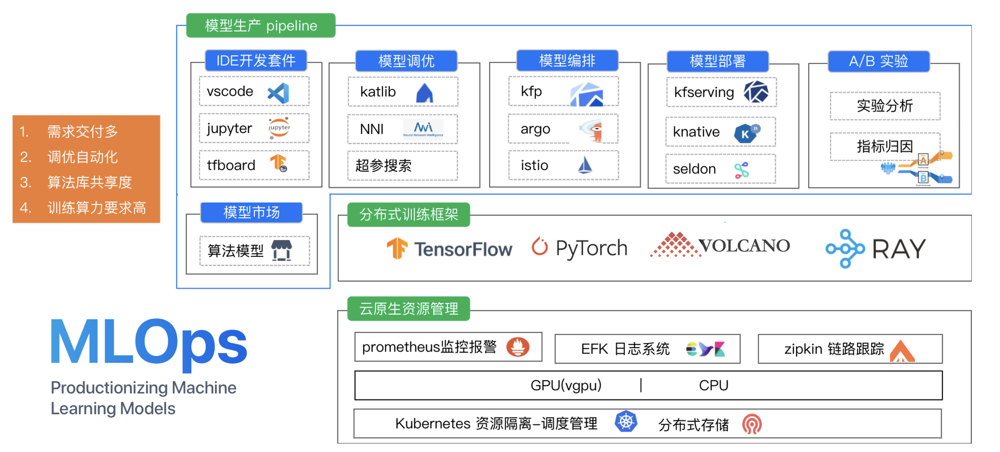](https://blog.csdn.net/luanpeng825485697/article/details/123619334)

[点击](https://blog.csdn.net/luanpeng825485697/article/details/123619334)查看更多细节内容

### 多集群管控

cube支持多集群调度，可同时管控多个训练或推理集群。在单个集群内，不仅做到一个项目组内在线开发、训练、推理的隔离，还可以做到一个k8s集群下多个项目组算力的隔离。另外在不同项目组下的算力间具有动态均衡的能力，能够在多项目间共享公共算力池和私有化算力池，做到成本最低化。
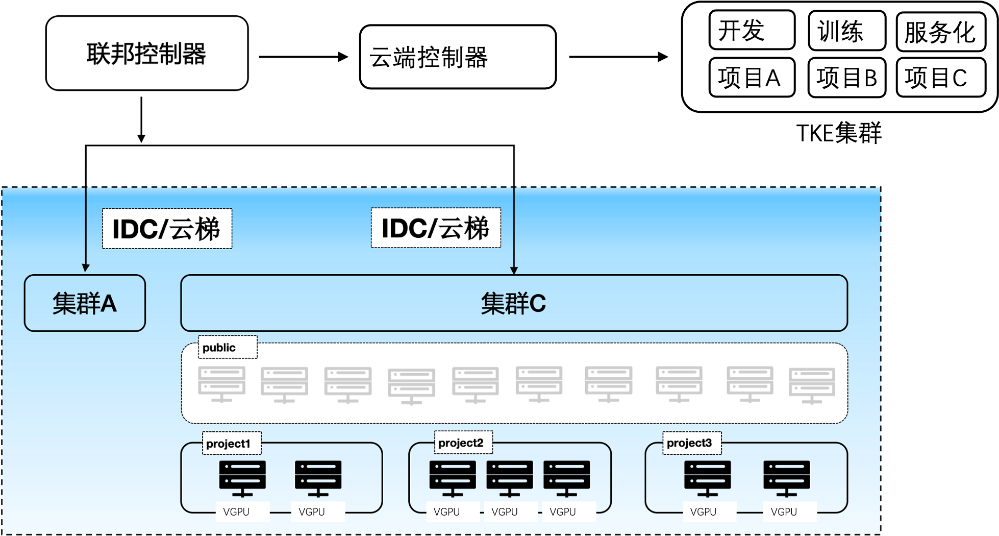

### 分布式存储

cube会自动为用户挂载用户个人目录，同一个用户在平台任何地方启动的容器目录下/mnt/$username均为用户个人子目录。可以将pvc/hostpath/memory/configmap等挂载成容器目录。同时可以在项目组中配置项目组的默认挂载，进而实现一个项目组共享同一个目录等功能。

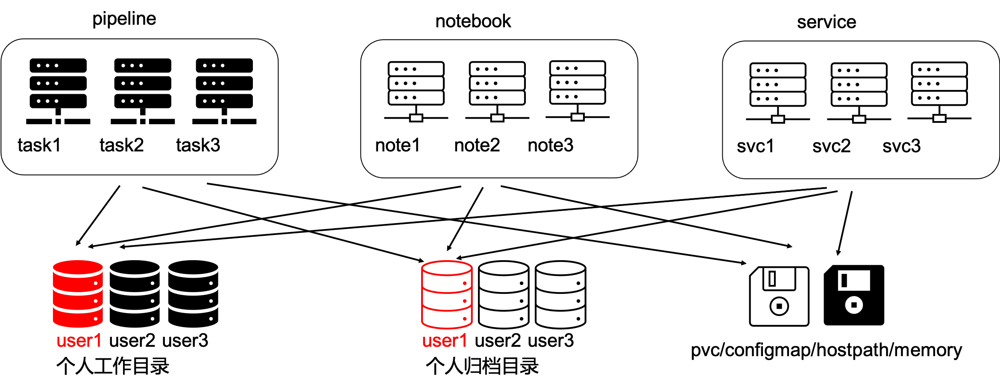

### 在线开发

cube支持在线jupyterlab/theia(vscode)等功能，多用户，多实例，支持cpu/gpu版本。另外支持在线构建docker镜像，免除算法同学docker学习成本

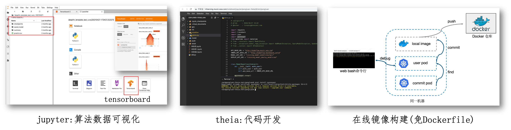

### 拖拉拽pipeline编排

支持单任务调试、分布式任务日志聚合查看，pipeline调试跟踪，任务运行资源监控，以及定时调度功能(包含补录，忽略，重试，依赖，并发限制，过期淘汰等功能)

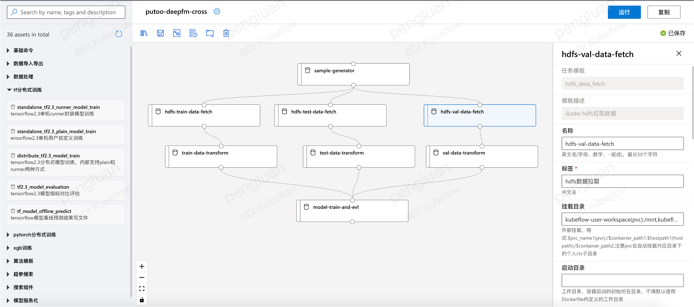

### 功能模板化

为了避免重复开发，对pipeline中的task功能进行模板化开发。平台开发者或用户可自行开发模板镜像，将镜像注册到平台，这样其他用户就可以复用这些功能。平台自带模板在job-template目录下

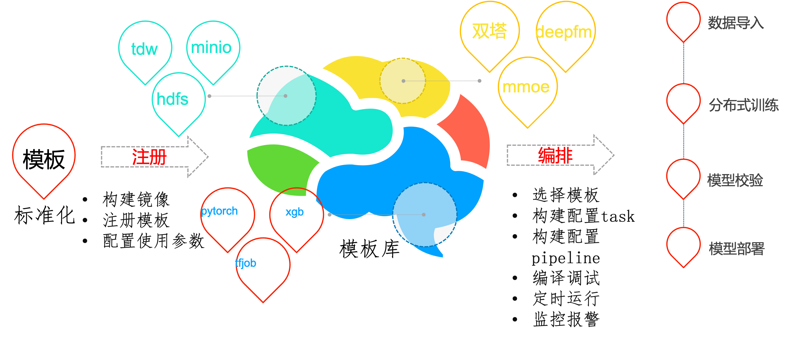

### nni超参搜索

除了包含katib超参搜索，也加入了nni的超参搜索，支持更多的算法

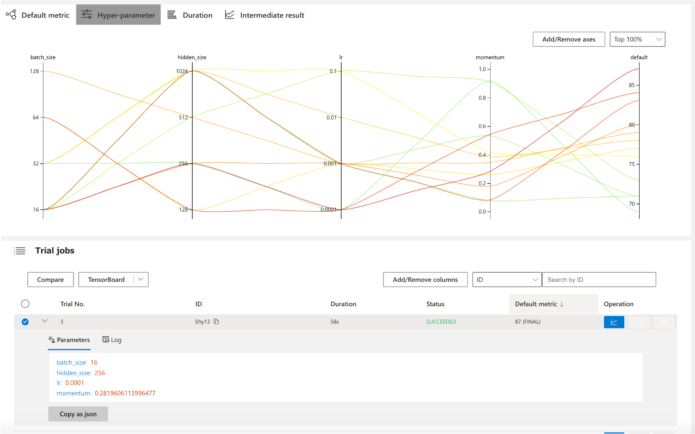

### 分布式框架

以k8s为核心，支持tf分布式训练、pytorch分布式训练、spark分布式数据处理、ray分布式超参搜索、mpi分布式训练、horovod分布式训练、nni分布式超参搜索、mxnet分布式训练、volcano分布式数据处理、kaldi分布式语音训练等，
以及在此衍生出来的分布式的数据下载，hdfs拉取，cos上传下载，视频采帧，音频抽取，分布式的训练，例如推荐场景的din算法，ComiRec算法，MMoE算法，DeepFM算法，youtube dnn算法，ple模型，ESMM模型，双塔模型，音视频的wenet，containAI等算法的分布式训练。

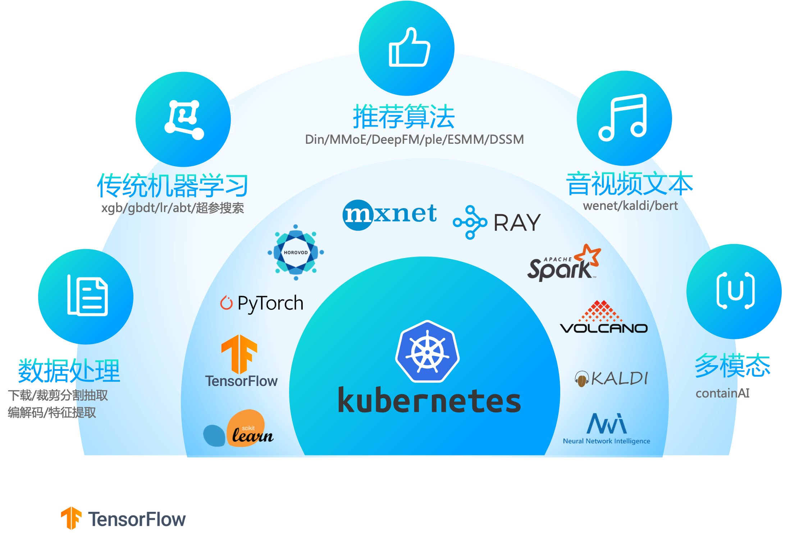

### 推理服务

0代码发布推理服务从底层到上层，包含服务网格，serverless，pipeline，http框架，模型计算。

 - 服务网格阶段：主要工作是代理流量的中转和管控，例如分流，镜像，限流，黑白名单之类的。

 - serverless阶段：主要为服务的智能化运维，例如服务的激活，伸缩容，版本管理，蓝绿发布。

 - pipeline阶段：主要为请求在各数据处理/推理之间的流动。推理的前后置处理逻辑等。

 - http/grpc框架：主要为处理客户端的请求，准备推理样本，推理后作出响应。

 - 模型计算：模型在cpu/gpu上对输入样本做前向计算。

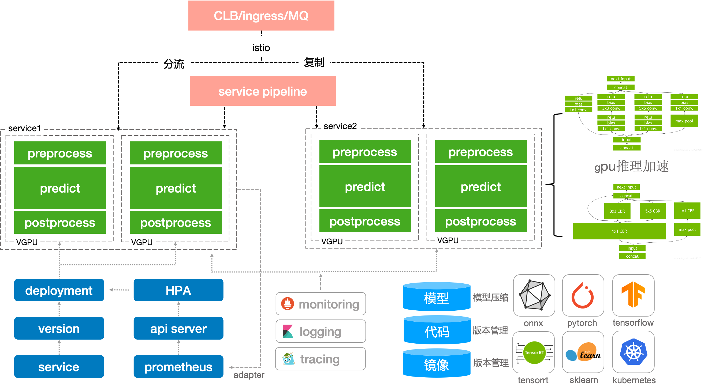

### 实时训练

tmeps支持tf框架实时训练，秒级上线，能应对embedding稀疏大模型推荐场景

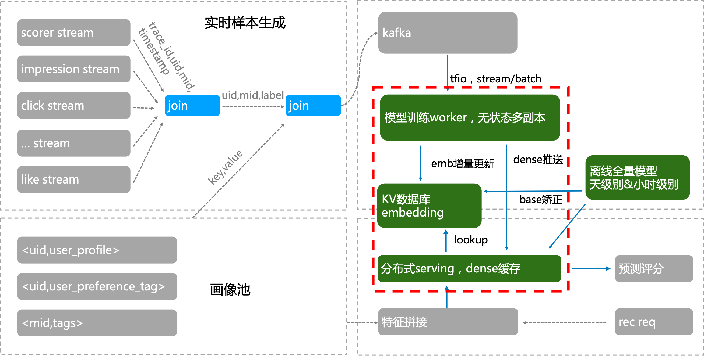

# 平台部署

参考install/README.md

平台完成部署之后如下:

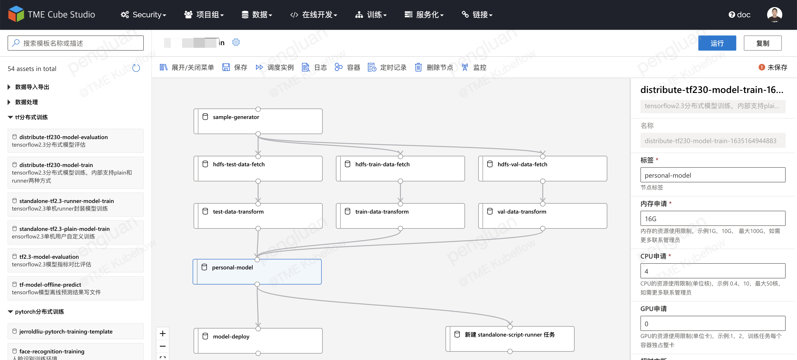

