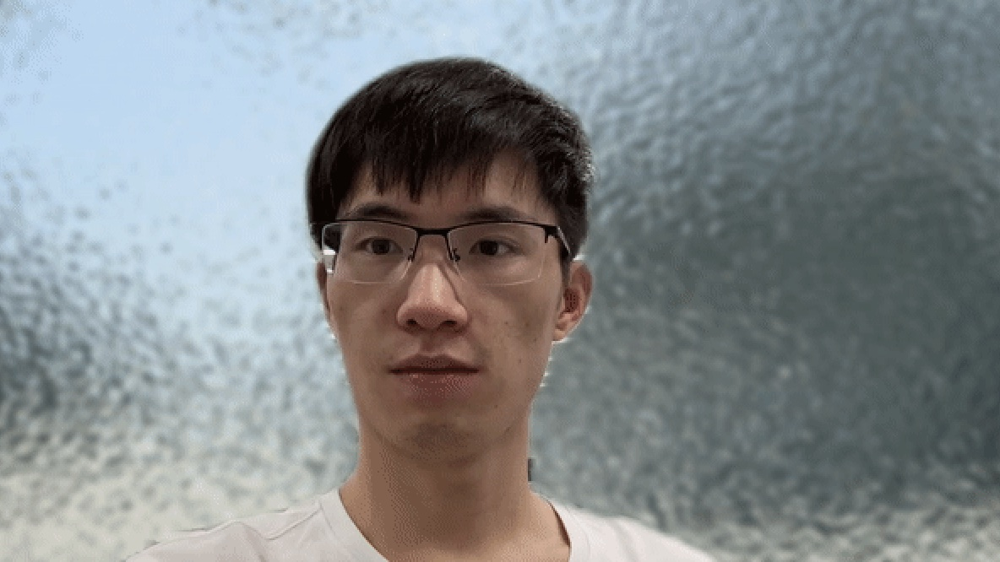

#  [视频教程 快速入门](https://www.bilibili.com/video/BV1X84y1y7xy/?vd_source=bddb004da42430029e7bd52d0bdd0fe7)

# 开发者：开发新的AI应用
新建应用目录（可直接复制参考app1应用），在新应用目录下新建init.sh  Dockerfile  app.py文件，

其中 
 - Dockerfile为镜像构建 
 - init.sh位初始化脚本
 - app.py为应用启动(训练/推理/服务)，需要补齐Model类的基础参数
 - 其他自行添加配套内容

镜像调试，基础镜像为conda环境。先使用如下命令启动基础环境进入容器

ccr.ccs.tencentyun.com/cube-studio/aihub:base-python3.9 为conda，python3.9环境

ccr.ccs.tencentyun.com/cube-studio/aihub:base-python3.8 为conda，python3.8环境

ccr.ccs.tencentyun.com/cube-studio/aihub:base-python3.6 为conda，python3.6环境

ccr.ccs.tencentyun.com/cube-studio/aihub:base 无python环境

ccr.ccs.tencentyun.com/cube-studio/aihub:base-cuda11.4 无python环境

```bash
# 进入模型应用
# 获取当前项目名作为应用名
aiapp=$(basename `pwd`)
cube_dir=($(dirname $(dirname "$PWD")))
chmod +x $cube_dir/src/docker/entrypoint.sh
sudo docker run --name ${aiapp} --privileged -it -e APPNAME=$aiapp -v $cube_dir/src:/src -v $PWD:/app -p 80:80 -p 8080:8080 --entrypoint='/src/docker/entrypoint.sh' ccr.ccs.tencentyun.com/cube-studio/aihub:base-python3.9 bash 

```
补全init.sh环境脚本。
```bash
# init.sh 脚本会被复制到容器/根目录下，环境文件不要放置在容器/app/目录下，不然会被加载到git
cp init.sh /init.sh && bash /init.sh
```
补齐app.py，运行调试
```bash
python app.py
```
生成aiapp的镜像
```bash
aiapp=$(basename `pwd`)
docker build -t ccr.ccs.tencentyun.com/cube-studio/aihub:${aiapp}  .
```

# 用户：部署体验应用
首先需要部署docker
```bash
# 获取当前项目名作为应用名
aiapp=$(basename `pwd`)
cube_dir=($(dirname $(dirname "$PWD")))
chmod +x $cube_dir/src/docker/entrypoint.sh
sudo docker run --name ${aiapp} --privileged --rm -it -e APPNAME=$aiapp -v $cube_dir/src:/src -v $PWD:/app -p 80:80 --entrypoint='/src/docker/entrypoint.sh' ccr.ccs.tencentyun.com/cube-studio/aihub:${aiapp} python app.py 

```


此目录包含大量开源深度学习算法，包括但不限于

# 机器视觉

## 图像分类

二分类
- SVM

多类别分类：
 - LetNet
 - AlexNet
 - VGGNet系列
 - GoogLeNet
 - ResNet系列
 - Inception系列
 - DenseNet系列

多标签分类：
- R-CNN&LSTM

## 图像分割

- 普通分割：阈值处理分割、k-means聚类、基于直方图、边缘检测、GrabCut算法

- 语义分割：

- 实例分割：FCN、DeepLab、Pyramid Scene Parsing Network、Mask R-CNN、U-Net




## 图像生成与转换

- 变分自编码器（VAE）：FCN-U-NET

- 生成对抗网络（GAN）：DCGAN

animegan


- 有监督图像转换：CGAN、pix2pix

- 无监督图像转换：cycleGAN


stable-diffusion


## 目标检测

- 基于区域提取两阶段: R-CNN、SPP-Net、FAST R-CNN、FASTER R-CNN

- 基于回归单阶段: YOLO系列、SSD


## 目标跟踪

- VOT系列

## 视频分析

## 图像重构（图像修复）

- Context Encoder
- MSNPS
- GLCIC
- Shift-Net
- DeepFill
- GMCNN
- PartialConv
- EdgeConnect


## 超分辨率

- SRCNN

## 风格迁移

- VGG系列

## 人体姿态估计

- opecv&mediapipe

## ocr

[paddleocr](../paddleocr/README.md)


[ddddocr](../ddddocr/README.md)


## 图像检索

## 图像识别

## 人脸识别

## 无人驾驶

## 手势识别

