# 文档目录
	example
	- notebook     	# 在线notebook使用
	- job-template  # 模板制作与使用
	- pipeline: 	# 任务流使用
	- images        # 镜像制作 && 常用基础镜像
	
# 基础认识：
	
__容器__：对于建模人员，可以认为容器是一个轻量的虚拟机，一个机器可以同时启动多个容器，容器之间资源是隔离的。在平台上运行的任务，最终都会以容器内进程的形式运行在实体机上。所有容器的/mnt目录下都是自己的个人工作目录，容器重启后环境消失。

__镜像__：可以将容器整个操作系统的文件和目录打包成镜像，只需要解压打包好的容器镜像，容器就被重现出来了。所以我们可以用这种方式打包运行ml任务的复杂环境。

__任务模板__：当我们要在平台例行化运行一个ml任务（例如xgb分类），可以先定义好这个任务用到的镜像，需要什么参数，分配多少资源等信息，形成一个任务模板。以后使用的时候只需选择模板并填写相应参数即可。

__任务流(pipeline)__: 多个任务及其依赖关系形成的DAG图。任务的构建产物可以在任务间传递。

__运行实例__：任务流的一次运行。

__notebook__：开启一个jupyter-notebook，自动挂载个人工作目录。有jupyter、vscode两种模式
	
# 加入项目组

### 申请加入项目组

路径：项目组->项目分组，oa联系creator将自己加入到项目组中

备注：

- 每个人自动都在public项目组中
- 可自行创建项目组

### creator添加用户

路径：项目组->项目分组。编辑项目组，添加组成员。creator角色的组成员可以添加其他用户进组

### 项目组控制调度集群（管理员学习）

平台支持跨集群调度。需要管理员创建集群并配置到系统配置后，可通过项目组的expand字段控制项目组的调度集群
	
	{
		"cluster": "dev"
	}

### 项目组控制调度机器（管理员学习）

平台支持单集群中划分资源组。需要管理员配置不同机器所属的资源组后，可通过项目组的expand字段控制项目组的调度机器
	
	{
		"node_selector": "org=public"
	}

# 在线notebook开发

### notebook支持类型
1. Jupyter （cpu/gpu）
2. vscode（cpu/gpu）

### 支持功能
1. 代码开发/调试，上传/下载，命令行，git工蜂/github，内网/外网，tensorboard，自主安装插件

### 添加notebook
路径：在线开发->notebook->添加

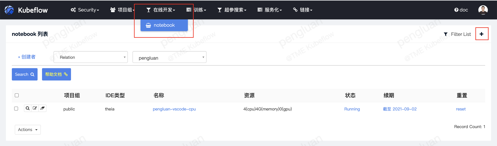

备注：
1. Running状态下，方可进入
2. 无法进去时，reset重新激活
3. notebook会自动挂载一下目录
 - a）个人工作目录到容器 /mnt/$username
 - b）个人归档目录到容器/archives/$username

### jupyter示例：

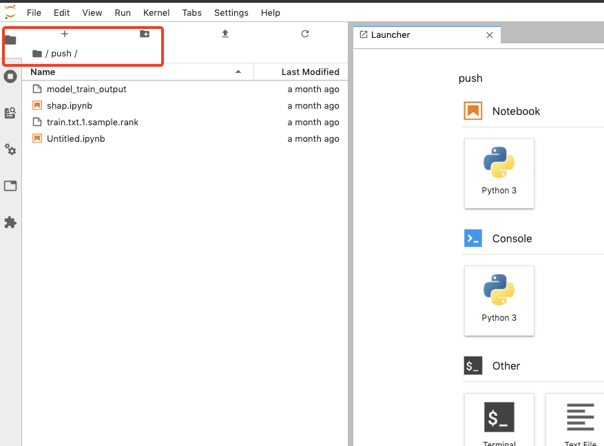

### vscode示例：

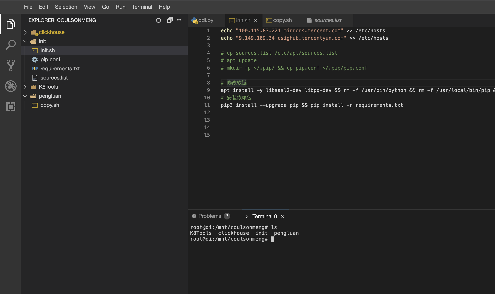

### 切换归档目录示例：

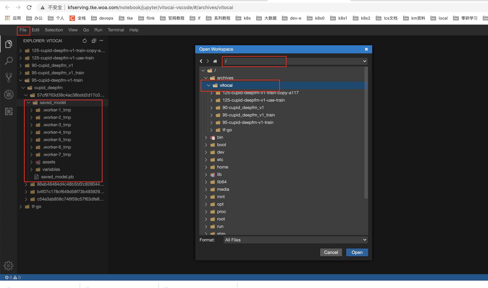

### tensorboard示例：

进入到对应的日志目录，再打开tensorboard按钮

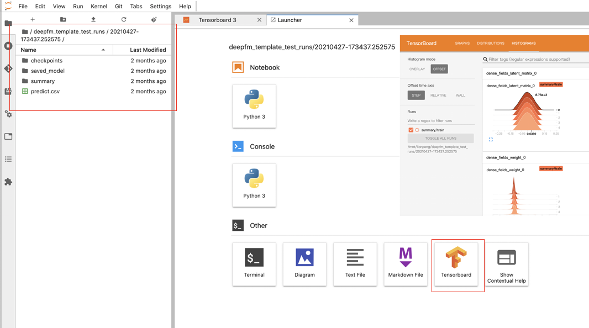

# 在线构建镜像

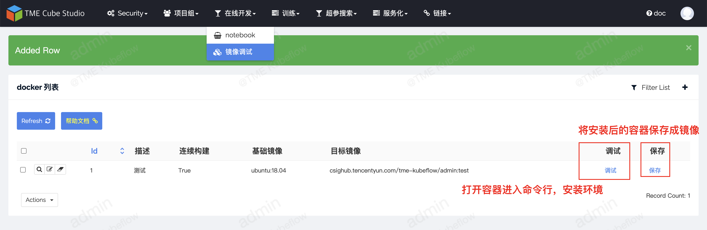

### 常用基础镜像

### ubuntu
- ai.tencentmusic.com/tme-public/ubuntu-gpu:cuda10.1-cudnn7
- ai.tencentmusic.com/tme-public/ubuntu-gpu:cuda10.1-cudnn7-python3.6
- ai.tencentmusic.com/tme-public/ubuntu-gpu:cuda10.1-cudnn7-python3.7
- ai.tencentmusic.com/tme-public/ubuntu-gpu:cuda10.1-cudnn7-python3.8
- ai.tencentmusic.com/tme-public/gpu:ubuntu18.04-python3.6-cuda10.1-cuda10.0-cuda9.0-cudnn7.6-base

# 配置/调试/定时运行pipeline

### 创建pipeline

路径：训练->任务流->新建

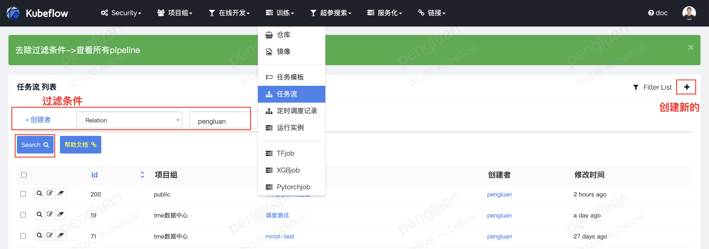

主要配置： 参考每个配置参数的描述

### 编排pipeline

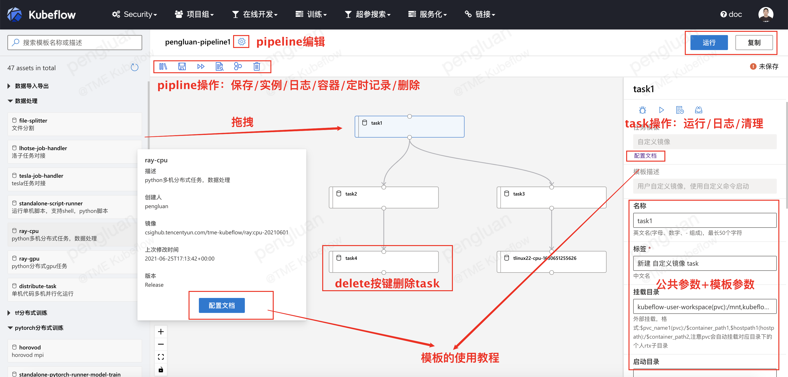

 - task公共参数：参考每个配置的描述  
 - task的模板参数：参考每个模板的链接教程文档

### 运行调试

##### task运行调试：

使用task的run按钮和log按钮可单独调试一个task

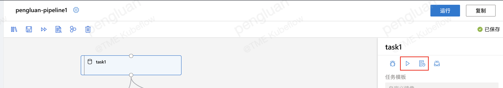

##### pipeline运行调试：

pipeline的运行按钮发起调度

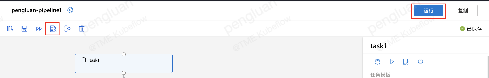

##### pipeline日志效果：

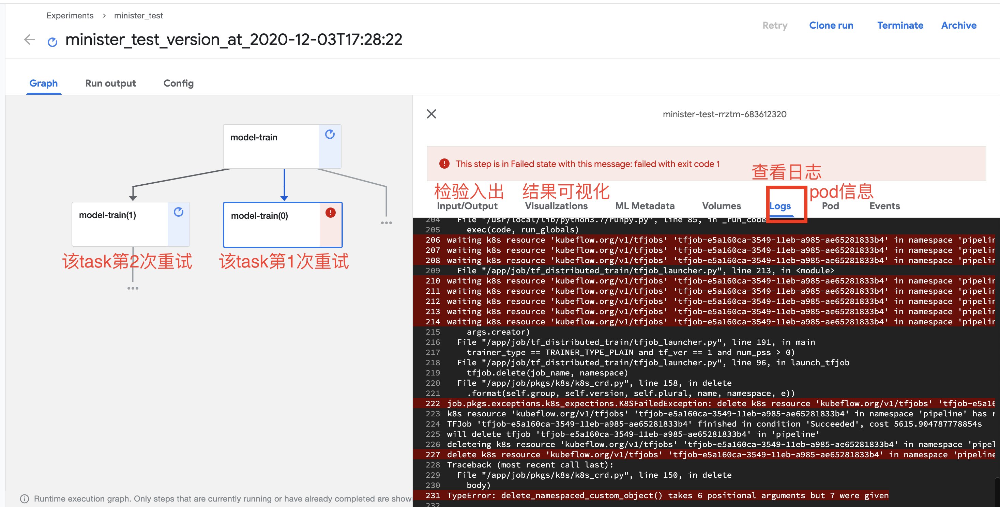

### pod查看示意图

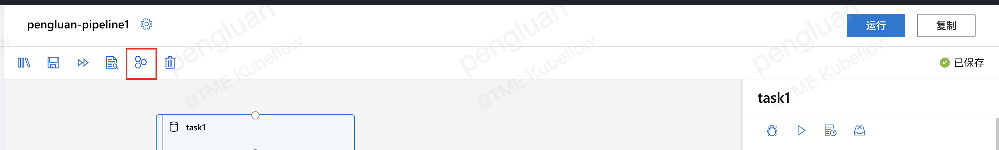

pod效果：

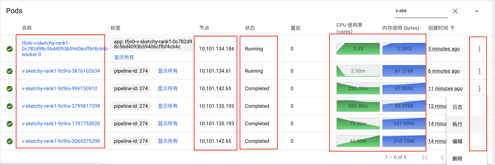

### 实例记录

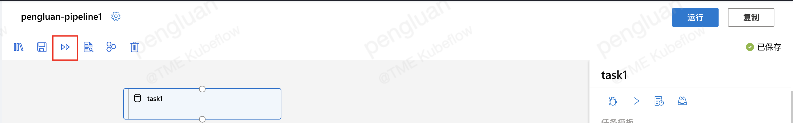

调度实例记录。停止可以清除调度容器

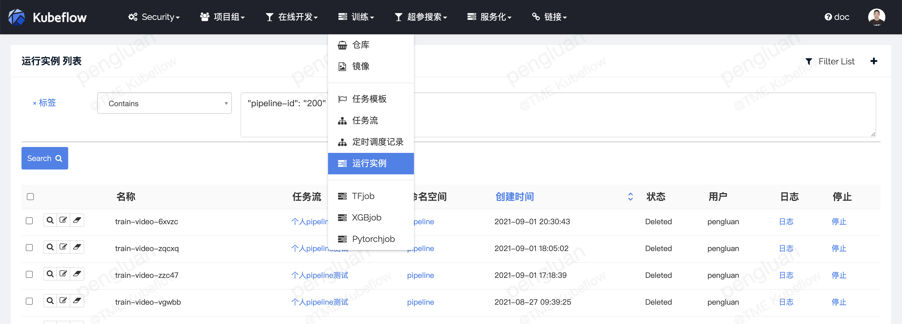

### 定时调度

配置定时：pipeline编辑界面

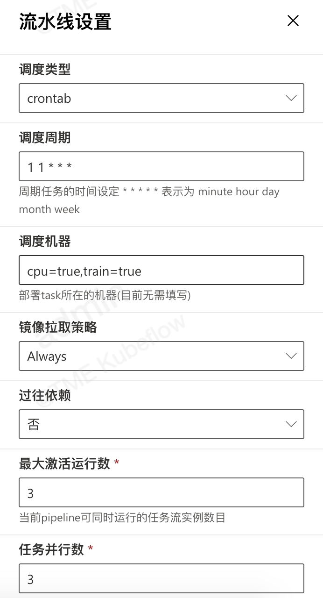

查看路径：训练-定时调度记录

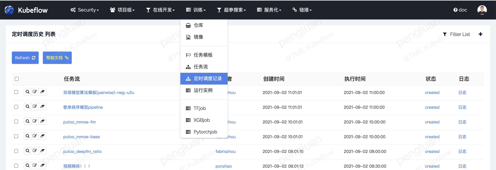

字段说明：执行时间为这个pipeline本次调度该发起的时间点  
状态：comed，为调度配置已经产生。created为调度已经发起。

##### 操作说明

	1、平台会根据pipeline的配置决定是否发起调度。
	2、状态链接中可以看到本地调度发起的workflow的运行情况
	3、日志链接中可以看到本地调度发起的日志
