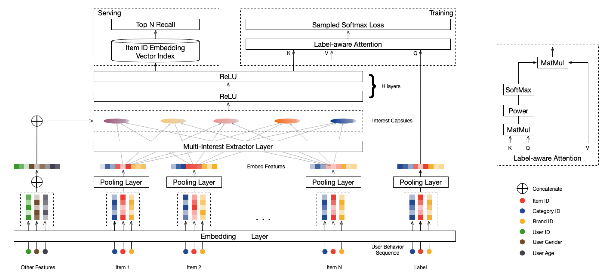

[TOC]  
  
## 模型说明  
MIND模型是由阿里巴巴搜索推荐事业部在 CIKM2019 的论文 Multi-Interest Network with Dynamic Routing for Recommendation at Tmall 中提出，这是一个用于推荐召回阶段的模型。召回阶段需要根据用户的兴趣从海量的商品中去检索出相关候选 Item，满足推荐相关性和多样性需求，MIND模型利用动态路由 Dynamic Routing 将用户历史行为自适应地聚合成可以表示用户不同兴趣的多个向量，同时使用标签感知注意力机制 Label-Aware Attention，来帮助学习具有多个向量的用户表示。  
  
MIND模型支持item使用多个不同的特征来进行表示，同时还可以引入用户的其他属性作为特征，模型结构如下图所示：  
  
  
  
  
## 模板配置  
MIND算法模板的配置示例如下：  
- 【注意】使用者可以先阅读[《pipeline各任务配置》文档](http://tapd.oa.com/kubeflow/markdown_wikis/show/#1220424693001722117)中的**tensorflow模型训练任务配置.runner封装方式**一节了解模型训练任务的一般配置方法；  
- 【注意】示例中并没有使用到全部可选的模型参数，使用者可根据自己的需求查看**参数说明**一节自行进行配置。  
```  
{  
    "num_workers": 1,  
    "node_affin": "only_cpu",  
    "pod_affin": "spread",  
    "timeout": "100d",  
    "job_detail": {  
        "model_input_config_file": "${PACK_PATH}$/input_config_data.json",  
        "model_args": {  
            "name": "mind_model",  
            "item_embedding_dim": 32,   
            "seq_max_len": 50,   
            "k_max": 3,   
            "dynamic_k": false,   
            "pow_p": 1,   
            "capsule_size": null,  
            "dnn_hidden_widthes":[64,32],   
            "dnn_act": "relu",   
            "dnn_dropout": 0.1,   
            "dnn_use_bn": false,   
            "dnn_l1_reg": null,   
            "dnn_l2_reg": 0.01  
        },  
        "train_data_args": {  
            "data_file": "${PACK_PATH}$/train_data.csv",  
            "field_delim": ",",  
            "with_headers": true  
        },  
        "val_data_args": {  
            "data_file": "${PACK_PATH}$/test_data.csv",  
            "field_delim": ",",  
            "with_headers": true  
        },  
        "test_data_args": {  
            "data_file": "${PACK_PATH}$/test_data.csv",  
            "field_delim": ",",  
            "with_headers": true  
        },  
		"predict_data_args": {  
            "data_file": "${PACK_PATH}$/predict_data.csv",  
            "field_delim": ",",  
            "with_headers": true,  
            "model_input_config_file": "${PACK_PATH}$/item_config.json"  
        },  
        "train_args": {  
            "batch_size": 512,  
            "epochs": 20,  
            "train_type": "compile_fit",  
            "num_samples": 100000,  
            "num_val_samples": 50000,  
            "optimizer": {  
                "type": "adam",  
                "args": {  
                    "learning_rate": 0.001  
                }  
            },  
            "losses": {  
                "type": "sampled_softmax_loss",  
                "args": {  
                    "num_samples": 20  
                }  
            },  
            "metrics": [  
                [  
                    {  
                        "type": "topk_hitrate",  
                        "args": {  
                            "k": 50,  
                            "name": "top50_hitrate"  
                        }  
                    },  
                    {  
                        "type": "topk_hitrate",  
                        "args": {  
                            "k": 100,  
                            "name": "top100_hitrate"  
                        }  
                    },  
                    {  
                        "type": "topk_hitrate",  
                        "args": {  
                            "k": 200,  
                            "name": "top200_hitrate"  
                        }  
                    },  
                    {  
                        "type": "topk_hitrate",  
                        "args": {  
                            "k": 500,  
                            "name": "top500_hitrate"  
                        }  
                    }  
                ]  
            ],  
            "train_speed_logger": {  
                "every_batches": 1000,  
                "with_metrics": true  
            },  
            "tensorboard":{  
                "profile_batch": [200,300]  
            },  
            "early_stopping": {  
                "monitor": "top50_hitrate",  
                "mode": "max",  
                "patience": 3,  
                "min_delta": 0.001  
            }  
        },  
        "eval_args": {  
            "batch_size": 512,  
            "metrics": [  
                [  
                    {  
                        "type": "topk_hitrate",  
                        "args": {  
                            "k": 50,  
                            "name": "top50_hitrate"  
                        }  
                    },  
                    {  
                        "type": "topk_hitrate",  
                        "args": {  
                            "k": 100,  
                            "name": "top100_hitrate"  
                        }  
                    },  
                    {  
                        "type": "topk_hitrate",  
                        "args": {  
                            "k": 200,  
                            "name": "top200_hitrate"  
                        }  
                    },  
                    {  
                        "type": "topk_hitrate",  
                        "args": {  
                            "k": 500,  
                            "name": "top500_hitrate"  
                        }  
                    }  
                ]  
            ],  
            "output_file": "${DATA_PATH}$/mind-res.json"  
        },  
		"predict_args": {  
            "model_path": "${DATA_PATH}$/saved_model/mind_model-item_embeddings_model/",  
            "batch_size": 1024,  
            "result_field_delim": " ",  
            "output_delim": ",",  
            "write_headers": true  
        }  
    }  
}  
  
```  
## 配置参数说明  
在上一节的算法模板配置示例中，我们需要重点关注的是**导出embedding的配置**，以及**model_input_config_file**和**model_args**中的内容。  
  
### 导出embedding配置  
#### 新导出方式配置  
目前MIND模型支持通过配置predict_args的方式来进行item embedding的预测，具体配置参数及含义可参考 [pipeline各任务配置说明](http://tapd.oa.com/kubeflow/markdown_wikis/show/#1220424693001722117) 中的 [**tensorflow模型离线预测任务配置**](http://tapd.oa.com/kubeflow/markdown_wikis/show/#1220424693001722117@toc13) 小节。  
  
以本算法模板中使用的配置为例：  
```  
"predict_data_args": {  
    "data_file": "${PACK_PATH}$/predict_data.csv",  
    "field_delim": ",",  
    "with_headers": true,  
    "model_input_config_file": "${PACK_PATH}$/item_config.json"  
},  
...  
"predict_args": {  
    "model_path": "${DATA_PATH}$/saved_model/mind_model-item_embeddings_model/",  
    "batch_size": 1024,  
    "result_field_delim": " ",  
    "output_delim": ",",  
    "write_headers": true  
}  
```  
通过`predict_data_args`来配置需要预测的item的数据文件和描述文件，数据文件通过`data_file`配置，其中包含与训练过程中相同的item特征列，描述文件通过`model_input_config_file`配置，其中各特征的`embedding_name, embedding_dim`等设置应该与训练过程中的数据描述文件相同。  
通过`predict_args`来配置预测结果文件的生成，其中`model_path`需要配置为本次任务中保存下来的 Item_Embedding 模型，其位置在`${DATA_PATH}$/saved_model/mind_model-item_embeddings_model/`下，其他设置可参考 [**tensorflow模型离线预测任务配置**](http://tapd.oa.com/kubeflow/markdown_wikis/show/#1220424693001722117@toc13) 。  
  
#### 旧导出方式配置  
旧导出方式与YouTubeDNN导出item embedding相似，如果使用旧的导出方式，需要在job_detail中进行配置，本小节提供了一个简单的配置示例，具体参数含义如下：  
```  
"job_detail": {  
        "model_input_config_file": "${PACK_PATH}$/input_config_data.json",  
        "user_embedding_file": "${DATA_PATH}$/user_embeddings.csv",  
        "item_embedding_file": "${DATA_PATH}$/item_embeddings.txt",  
        "predict_data_file": "${PACK_PATH}$/predict_data.csv",  
        "item_embedding_predict_parallel": 1,  
        "user_embedding_predict_parallel": 20,  
        "predict_batch_size": 1000,  
        "uid_col_name": "uin",  
		...  
```  
- **load_model_from**：可指定模型加载路径，如果配置了该参数且路径真实存在，则会跳过训练过程，从路径加载模型。该参数实现两个目的：  
	- 不训练模型，只用于使用数据来评估已经训练好的模型的指标（需要配置val_data_args和eval_args）；  
	- 使用已经训练好的模型预测生成user embedding文件和item embedding文件。  
- **user_embedding_file**：生成user embedding时结果文件的存放路径，如果为空，则不进行user embedding预测。需要注意的是，MIND模型默认生成的是user的多个兴趣，生成的user embedding文件有k+1列，列之间用制表符分隔，第一列为uid，后续每一列为用户兴趣的embedding表示，embedding各维度用逗号分隔。  
- **item_embedding_file**：生成item embedding时结果文件的存放路径，如果为空，则不进行item embedding预测。需要注意的是，目前MIND模型在导出item embedding时只支持导出item id的embedding结果，生成的item embeding中每一行的格式为 !!#e06666 `{"MD": "<id>","BN": "push_playlist_recall", "VA": "txt|<embedding>"} `!!，其中`<id>`表示item id，`<embedding>`表示对应embedding，embedding各维度用逗号分隔。  
- **predict_data_file**：用于预测item/user embedding的数据文件，如果为空，则item和user embedding预测都不会进行。!!#e06666 文件格式目前必须为csv，且必须包含文件头!!。item id列对应的是model_input_config_file中指定为label的那个列。uid列名需通过uid_col_name指定。（!!#e06666 注意predict_data_file除了uid列外，其他列必须至少包含与训练数据同样的列!!）  
- **uid_col_name**：predict_data_file文件中uid对应的列名。  
- **predict_batch_size**：预测embedding时的batch大小。  
- **item_embedding_predict_parallel**：预测item embedding时的并行度。默认为1。速度和内存占用都会线性增加。  
- **user_embedding_predict_parallel**：预测user embedding时的并行度。默认为1。速度和内存占用都会线性增加。  
  
### 输入数据配置  
关于输入数据的配置，即**model_input_config_file**的内容参考 [算法模板数据配置说明](http://tapd.oa.com/kubeflow/markdown_wikis/show/#1220424693001865665)，一个可供参考的MIND模型输入数据配置如下：  
- 【注意】MIND模型的输入包括用户属性等特征（特征组使用`user`命名），用户历史行为特征（特征组使用`item`命名），此外还包括MIND模型在训练时用于Label Aware Attention计算的目标item的特征（特征组使用`target`命名）；  
- 【注意】MIND模型的输入中，`item`特征组是必需的，`user`特征组可以不存在，而模型在训练时，`target`特征组也是必需的；  
- 【注意】MIND模型的输入中，`item`特征组内的特征需要是序列特征，序列用分隔符`val_sep`串联起来表示，每个特征需要将`embedding_combiner`设置为`seq_pad`，并且可以指定将序列padding到的最大长度`max_len`（不指定则会padding到128）；MIND模型的输入是支持多个`item`特征的，如果`item`特征组内有多个特征，那么各个特征相同位置的序列长度应该尽量相同；`target`特征组内的特征由于不是序列特征而是单个item，因此`embedding_combiner`不需要设置为`seq_pad`；  
- 【注意】MIND模型的输入中，`item`特征组、`target`特征组和`labels`特征**必须要指定`embedding_name`**，并且对于含义相同的特征，`embedding_name`**必须相同**，相应的`vocab_size`和`embedding_dim`等也需要保持一致；以参考示例作为说明，`item`特征组中的"list_item_id"和`target`特征组中的"target_item_id"以及`labels`中的"item_id"都是表示物品item的id，因此其`embedding_name`都保持一致，都为"item_id"；  
- 【注意】MIND模型的输入配置中，应该将`item`特征组的特征说明放置在`target`和`labels`特征说明的前面；  
- 【注意】MIND模型的输入中，如果有每个序列特征的真实长度特征，应将其命名为`hist_len`，可将其分类到`item_len`特征组  
  
```  
{  
    "version": 2,  
    "inputs": {  
        "defs":[  
            {"name": "user_id", "dtype": "int32", "vocab_size":1000, "embedding_dim":32},  
            {"name": "user_gender", "dtype": "int32", "vocab_size":2, "embedding_dim":32, "hash_type":"mod"},  
            {"name": "user_age", "dtype": "int32", "vocab_size":50, "embedding_dim":32},  
              
            {"name": "list_item_id", "dtype": "int32", "val_sep":",", "vocab_size":2000, "embedding_dim":32, "max_len":20, "embedding_combiner": "seq_pad", "embedding_name":"item_id"},  
            {"name": "list_category_id", "dtype": "int32", "val_sep":",", "vocab_size":300, "embedding_dim":32, "max_len":20, "embedding_combiner": "seq_pad", "embedding_name":"category_id"},  
            {"name": "list_brand_id", "dtype": "int32", "val_sep":",", "vocab_size":100, "embedding_dim":32, "max_len":20, "embedding_combiner": "seq_pad", "embedding_name":"brand_id"},  
              
            {"name": "target_item_id", "dtype": "int32", "embedding_name":"item_id", "vocab_size":2000, "embedding_dim":32},  
            {"name": "target_category_id", "dtype": "int32", "embedding_name":"category_id", "vocab_size":300, "embedding_dim":32}  
            {"name": "target_brand_id", "dtype": "int32", "embedding_name":"brand_id", "vocab_size":100, "embedding_dim":32}  
              
            {"name": "item_id", "dtype": "int32", "embedding_name":"item_id", "vocab_size":2000, "embedding_dim":32, "is_label":true}  
        ],  
        "groups":{  
            "item":["list_item_id","list_category_id","list_brand_id"],  
            "user":["user_id","user_gender","user_age"],  
            "target":["target_item_id","target_category_id","target_brand_id"]  
            "labels":["item_id"]  
        }  
    }  
}  
```  
  
### 模型参数说明  
关于MIND模型的配置，即**model_args**中的内容，具体含义如下：  
  
- **item_embedding_dim**：!!#e06666 必填!!。item embedding的维度，需要和输入描述文件中的表示item的特征使用的`embedding_dim`保持一致。  
- **seq_max_len**：!!#e06666 必填!!。序列特征的最大长度，需要和输入描述文件中`item`特征组中的各序列特征使用的`max_len`保持一致，如果特征中未设置最大长度，则需要设置该值为128。  
- **k_max**：!!#e06666 必填!!。用户兴趣数量，MIND模型中的用户多兴趣提取层（胶囊网络）会根据该值来产生多个不同的用户兴趣表征。  
- **dynamic_k**：!!#e06666 非必填!!。是否根据不同的用户动态调整用户兴趣值，默认为false。  
- **pow_p**：!!#e06666 非必填!!。调整Label Aware Attention中注意力分布的可调参数，默认为1。当p接近0时，每个兴趣胶囊将得到均匀的注意力，当p大于1时，随着p的增加，注意力计算中点积越大的值将得到越多的注意力。  
- **capsule_size**：!!#e06666 非必填!!。用户多兴趣提取层（胶囊网络）得到的中间向量的维度。如果不设置，则默认为`item_embedding_dim`。  
- **dnn_hidden_widthes**：!!#e06666 非必填!!。用户多兴趣提取层（胶囊网络）之后的DNN的隐层结构，即每层的宽度大小，从下至上，需要注意的是，最后一层的大小如果不等于`item_embedding_dim`，那么DNN将会自动增加一层以使输出向量的维度为`item_embedding_dim`。  
- **dnn_act**：!!#e06666 非必填!!。dnn隐藏层的激活函数，!!#e06666 如果设置为一个字符串，例如"relu"，则表示所有隐层的激活函数都是一样的；如果需要每层指定不同的激活函数，则可以设置为数组，例如["relu", "sigmoid"]，表示第一层使用relu，第二层使用sigmoid，层顺序与  *dnn_hidden_layers*  一致。设置的数组长度不一定与隐层数量一样，当  *dnn_hidden_act_fn* 长度超过隐层数量时，超出的部分会被自动忽略，如果比隐层数量短，则缺少部分对应的隐层就没有激活函数。如果是某个中间位置隐层不需要激活函数，而上下都需要，则对应位置设置为"none"即可，例如有三个隐层，其中第一和第三层分别是relu和sigmoid，而第二层不需要，则可以设置为["relu", "none", "sigmoid"]。!!  
- **dnn_dropout**：!!#e06666 非必填!!。dnn的层间dropout概率，!!#e06666 如果设置成一个值，例如0.5，则表示所有隐层都采用0.5的dropout；如果需要每层采用不同的dropout值，则可以设置为数组，例如[0.5, 0.2]，表示第一层采用0.5的dropout，第二层采用0.2的dropout。与 *dnn_hidden_act_fn* 类似，数组长度也不一定与隐层数量一样，长度不一样时，对应关系与 *dnn_act* 中说明一样。!!  
- **dnn_use_bn**：!!#e06666 非必填!!。dnn是否使用batch normalization，!!#e06666 如果设置成一个值，例如true，则表示所有层都使用batch normalize；如果各层不一样，则可以设置成数组，例如[true, false]，表示第一层使用BN，第二层不使用。与 *dnn_hidden_act_fn* 类似，数组长度也不一定与隐层数量一样，长度不一样时，对应关系与 *dnn_hidden_act_fn* 中说明一样。!!  
- **dnn_l1_reg**：!!#e06666 非必填!!。task网络的参数L1正则化系数，0或者None表示不需要正则化，默认为None。  
- **dnn_l2_reg**：!!#e06666 非必填!!。task网络的参数L2正则化系数，0或者None表示不需要正则化，默认为None。  
- **name**：!!#e06666 非必填!!。模型名字，可以自定义。默认为"MIND"。  
  
**!!#e06666 注意，MIND的loss和metric类型只能是sampled softmax和topk hitrate。!!**  
  
其中sampled softmax的参数如下：  
- **num_samples**：计算loss时，对于每个正样本，负样本采样的个数。  
- **sample_algo**：采样策略，支持如下几种采样策略，默认为"learned"：  
	- "**uniform**"：均匀采样，及所有类别被采样到的概率是一样的  
    - "**log_uniform**"：假设类别分布为Zipfian，即每个类被采样到的概率为$ p(class) = (log(class+2)-log(class+1))/log(max+1) $，class是类编号，max是最大编号，!!#ff0000 使用这个策略时需要实现对各个类别按照频率从大到小进行编号，即频率越大的类编号应该越小!!  
	- "**learned**"：在训练过程中对类别计数统计，初始时所有类别是均匀的，根据训练过程看到的数据逐步调整类别分布。  
	- "**fixed**"：如果用户实现知道类别分布，可以使用此策略传入类别分布信息，传递方式见下面sample_algo_params参数说明。  
- **sample_algo_params**：采样策略参数，!!#ff0000 **只对fixed策略有意义**，!!参数形式是一个dict，支持的字段有：  
	- **vocab_file**：以文件方式指定类别的分布，每一行对应一个类别的分布权重，这个权重可以是类的频数也可以是类的概率值。  
	- **unigrams**：以数组方式指定类别分布，数组中每一项对应一个类别的分布权重，这个权重可以是类的频数也可以是类的概率值。unigrams和vocab_file必须至少指定一个，如果同时指定，则以unigrams为准。  
	- **distortion**：!!#ff0000 非必填!!，对类别分布的扰动值，即每个类别的分布权重会先变成自己的distortion次方，因此distortion为1时跟原始分布一样，为0时就变成均匀分布。默认为1  
	- **num_reserved_ids**：!!#ff0000 非必填!!，类别编号的起始值，默认为0。  
  
其中topk hitrate metric的参数如下：  
- **k**：表示 top k  
- **name**：metric名字  
  
其他参数的意义都可以参考《pipeline各任务配置》文档。  
pipeline全流程的使用说明见[模型开发使用文档](http://tapd.oa.com/kubeflow/markdown_wikis/show/#1220424693001727011)  
  
## SERVING阶段User Multi-Interest Model的使用  
MIND模型在训练完成并保存模型时，会保存两个模型，其中一个是用于生成item embedding的Item模型，另一个是用于在线上动态更新用户多兴趣的User Multi-Interest模型。  
User Multi-Interest模型本质上就是一个完整的MIND模型，在Training阶段，由于输入数据中存在target item的特征，因此模型会与target item进行Label Aware Attention的计算用于模型训练；在Serving阶段，加载位于`${DATA_PATH}$/saved_model/mind_model/`下的MIND模型，在输入特征中不包含训练阶段的target item特征（需要注意，模型输入特征除target item特征之外应该与训练阶段的输入相同），则模型将会输出用户的多兴趣。