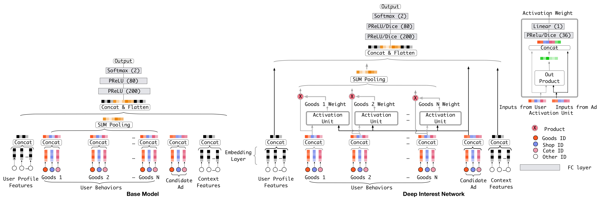

[TOC]  
  
## 模型说明  
DIN模型是阿里的阿里妈妈团队在 KDD2018 的论文 Deep Interest Network for Click-Through Rate Prediction 中提出的，这是一个用于CTR预估的序列化模型。Deep Interest Network, DIN，深度兴趣网络使用Attention机制，利用用户的历史行为序列来实现用户兴趣的多样性和局部聚焦。其模型结构如下图所示：  
  
  
  
图中左边的模型表示的是过去常用的DNN模型的结构，其对用户历史行为序列并未进行深入了解和利用，用户的一组历史行为会被转换成固定尺寸的embedding向量，而与用户的当前行为（或者候选Item）无关；而右边的模型则是DIN模型的结构，其引入了与Attention机制功能相似的Activation Unit来激活局部的相关兴趣，其能根据用候选Item计算历史行为的权重，使得与候选Item相关度更高的用户行为或兴趣获得更高的关注度。  
  
  
## 模板配置  
DIN算法模板的配置示例如下：  
- 【注意】使用者可以先阅读[《pipeline各任务配置》文档](http://tapd.oa.com/kubeflow/markdown_wikis/show/#1220424693001722117)中的**tensorflow模型训练任务配置.runner封装方式**一节了解模型训练任务的一般配置方法；  
- 【注意】示例中并没有使用到全部可选的模型参数，使用者可根据自己的需求查看**参数说明**一节自行进行配置。  
```  
{  
    "num_workers": 1,  
    "node_affin": "only_cpu",  
    "pod_affin": "spread",  
    "timeout": "100d",  
    "job_detail": {  
        "model_input_config_file": "${PACK_PATH}$/dataset_electronic/amazonelectronic_input_config.json",  
        "model_args": {  
            "name": "din_model",  
            "attn_units": [64, 32, 1],   
            "attn_act": ["dice", "dice"],   
            "attn_mode": "SUM",   
            "attn_norm": true,  
            "dnn_units": [256,128,64,2],   
            "dnn_act": ["dice","dice","dice"],   
            "dnn_dropout": 0.1,   
            "dnn_use_bn": false,   
            "dnn_l1_reg": null,   
            "dnn_l2_reg": null  
        },  
        "train_data_args": {  
            "data_file": "${PACK_PATH}$/dataset_electronic/train_data.csv",  
            "field_delim": ",",  
            "with_headers": true  
        },  
        "val_data_args": {  
            "data_file": "${PACK_PATH}$/dataset_electronic/vali_data.csv",  
            "field_delim": ",",  
            "with_headers": true  
        },  
        "test_data_args": {  
            "data_file": "${PACK_PATH}$/dataset_electronic/test_data.csv",  
            "field_delim": ",",  
            "with_headers": true  
        },  
        "train_args": {  
            "batch_size": 1024,  
            "epochs": 5,  
            "train_type": "compile_fit",  
            "num_samples": 2223958,  
            "num_val_samples": 384806,  
            "optimizer": {  
                "type": "adam",  
                "args": {  
                    "learning_rate": 0.001  
                }  
            },  
            "losses": "bce",  
            "metrics": [  
                [  
                    "auc",  
                    "bacc"  
                ]  
            ],  
            "train_speed_logger": {  
                "every_batches": 100,  
                "with_metrics": true  
            },  
            "tensorboard":{  
                "profile_batch": [200,300]  
            },  
            "early_stopping": {  
                "monitor": "val_auc",  
                "mode": "max",  
                "patience": 3,  
                "min_delta": 0.001  
            }  
        },  
        "eval_args": {  
            "batch_size": 1024,  
            "metrics": [  
                [  
                    "auc",  
                    "bacc"  
                ]  
            ],  
            "output_file": "${DATA_PATH}$/din-res.json"  
        }  
    }  
}  
  
```  
## 配置参数说明  
在上一节的算法模板配置示例中，我们需要重点关注的是**model_input_config_file**和**model_args**中的内容。  
  
### 输入数据配置  
关于输入数据的配置，即**model_input_config_file**的内容参考 [算法模板数据配置说明](http://tapd.oa.com/kubeflow/markdown_wikis/show/#1220424693001865665)，一个可供参考的DIN模型输入数据配置如下：  
- 【注意】DIN模型的输入包括用户属性等特征（特征组使用`user`命名），用户历史行为特征（特征组使用`item`命名），候选Item特征（特征组使用`target`命名）以及其他有关的上下文特征（特征组用`context`命名），除此之外还可以加入描述序列特征中各序列原始长度的特征`hist_len`，其应该被归到其他组中（如使用`others`命名）；  
- 【注意】DIN模型的输入中，`item`特征组和`target`特征组是必需的，其他特征组可以不需要；  
- 【注意】DIN模型的输入中，`item`特征组内的特征需要是序列特征，序列用分隔符`val_sep`串联起来表示，每个特征需要将`embedding_combiner`设置为`seq_pad`，并且可以指定将序列padding到的最大长度`max_len`（不指定则会padding到128）；  
- 【注意】DIN模型的输入中，`item`特征组、`target`特征组**必须要指定`embedding_name`**，并且对于含义相同的特征，`embedding_name`**必须相同**，相应的`vocab_size`和`embedding_dim`等也需要保持一致；以参考示例作为说明，`item`特征组中的"item_id_list"和`target`特征组中的"target_id"都是表示物品Item的ID，因此其`embedding_name`都保持一致，都为"item_id"；  
- 【注意】DIN模型的输入配置中，应该将`item`特征组的特征说明放置在`target`特征说明的前面；  
```  
{  
    "version": 2,  
    "inputs": {  
        "defs":[  
            {"name": "item_id_list", "dtype": "int32", "val_sep":",", "vocab_size":64000, "embedding_dim":32, "max_len":40, "embedding_combiner": "seq_pad", "embedding_name": "item_id"},  
            {"name": "item_cate_list", "dtype": "int32", "val_sep":",", "vocab_size":810, "embedding_dim":32, "max_len":40, "embedding_combiner": "seq_pad", "embedding_name": "item_cate"},  
            {"name": "target_id", "dtype": "int32", "vocab_size":64000, "embedding_dim":32, "embedding_name": "item_id"},  
            {"name": "target_cate", "dtype": "int32", "vocab_size":810, "embedding_dim":32, "embedding_name": "item_cate"},  
            {"name": "label", "dtype": "int32", "is_label":true},  
            {"name": "hist_len", "dtype": "int32"}  
        ],  
        "groups":{  
            "item":["item_id_list", "item_cate_list"],  
            "target":["target_id", "target_cate"],  
            "labels":["label"],  
            "others":["hist_len"]  
        }  
    }  
}  
```  
  
### 模型参数说明  
关于DIN模型的配置，即**model_args**中的内容，具体含义如下：  
  
- **attn_units**：!!#e06666 非必填!!。Activation Unit中输出网络的每一层的宽度，从下至上。默认是 \[36, 1\]。  
- **attn_act**：!!#e06666 非必填!!。Activation Unit中输出网络的激活函数，可以选择论文中使用的PReLU和DICE激活函数，默认全都设置为PReLU。!!#e06666 如果设置为一个字符串，例如"relu"，则表示所有隐层的激活函数都是一样的；如果需要每层指定不同的激活函数，则可以设置为数组，例如["relu", "sigmoid"]，表示第一层使用relu，第二层使用sigmoid，层顺序与  *expert_layers*  一致。设置的数组长度不一定与隐层数量一样，当  *expert_act*  长度超过隐层数量时，超出的部分会被自动忽略，如果比隐层数量短，则缺少部分对应的隐层就没有激活函数。如果是某个中间位置隐层不需要激活函数，而上下都需要，则对应位置设置为"none"即可，例如有三个隐层，其中第一和第三层分别是relu和sigmoid，而第二层不需要，则可以设置为["relu", "none", "sigmoid"]。!!  
- **attn_mode**：!!#e06666 非必填!!。Activation Unit得到的Activation Weight如何和用户行为序列进行结合，使用`"SUM"`表示使用矩阵乘法的方式融合，使用`"SEQ"`表示使用对应乘的方式进行融合，默认为`"SUM"`。  
- **attn_norm**：!!#e06666 非必填!!。Activation Unit得到的Activation Weight是否要进行softmax归一化，在论文中作者表示不进行归一化，希望保持兴趣的强度近似值，但是作者的代码以及实验效果都表明应该使用softmax归一化。默认为True。  
- **dnn_units**：!!#e06666 非必填!!。DIN模型中最后的MLP网络的每一层的宽度，从下至上。默认是 \[200, 80, 2\]。需要注意的是，如果是二分类问题，最后一维小于等于2，输出维度会被重置为1，并采用sigmoid作为最后的激活函数，如果是多分类问题，最后一维大于2，输出会采用softmax作为最后的处理函数。  
- **dnn_act**：!!#e06666 非必填!!。DIN模型中最后的MLP网络的激活函数，可以选择论文中使用的PReLU和DICE激活函数，默认全都设置为PReLU。!!#e06666 如果设置为一个字符串，例如"relu"，则表示所有隐层的激活函数都是一样的；如果需要每层指定不同的激活函数，则可以设置为数组，例如["relu", "sigmoid"]，表示第一层使用relu，第二层使用sigmoid，层顺序与  *expert_layers*  一致。设置的数组长度不一定与隐层数量一样，当  *expert_act*  长度超过隐层数量时，超出的部分会被自动忽略，如果比隐层数量短，则缺少部分对应的隐层就没有激活函数。如果是某个中间位置隐层不需要激活函数，而上下都需要，则对应位置设置为"none"即可，例如有三个隐层，其中第一和第三层分别是relu和sigmoid，而第二层不需要，则可以设置为["relu", "none", "sigmoid"]。!!  
- **dnn_dropout**：!!#e06666 非必填!!。DIN模型中最后的MLP网络的层间dropout概率，!!#e06666 如果设置成一个值，例如0.5，则表示所有隐层都采用0.5的dropout；如果需要每层采用不同的dropout值，则可以设置为数组，例如[0.5, 0.2]，表示第一层采用0.5的dropout，第二层采用0.2的dropout。与 *dnn_act* 类似，数组长度也不一定与隐层数量一样，长度不一样时，对应关系与 *dnn_act* 中说明一样。!!  
- **dnn_use_bn**：!!#e06666 非必填!!。DIN模型中最后的MLP网络是否使用batch normalization，!!#e06666 如果设置成一个值，例如true，则表示所有层都使用batch normalize；如果各层不一样，则可以设置成数组，例如[true, false]，表示第一层使用BN，第二层不使用。与 *dnn_act* 类似，数组长度也不一定与隐层数量一样，长度不一样时，对应关系与 *dnn_act* 中说明一样。!!  
- **dnn_l1_reg**：!!#e06666 非必填!!。DIN模型中最后的MLP网络的参数L1正则化系数，0或者None表示不需要正则化，默认为None。**实验表明设置该正则化项将会严重影响模型性能。**  
- **dnn_l2_reg**：!!#e06666 非必填!!。DIN模型中最后的MLP网络的参数L2正则化系数，0或者None表示不需要正则化，默认为None。**实验表明设置该正则化项将会严重影响模型性能。**  
- **name**：!!#e06666 非必填!!。模型名字，可以自定义。默认为"DIN"。  
  
  
其他参数的意义都可以参考《pipeline各任务配置》文档。  
pipeline全流程的使用说明见[模型开发使用文档](http://tapd.oa.com/kubeflow/markdown_wikis/show/#1220424693001727011)  
