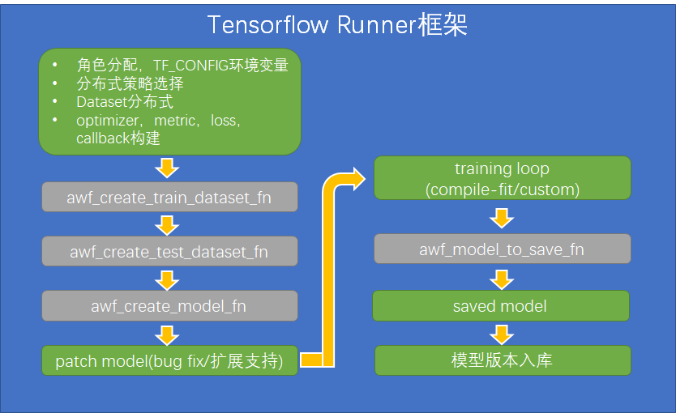
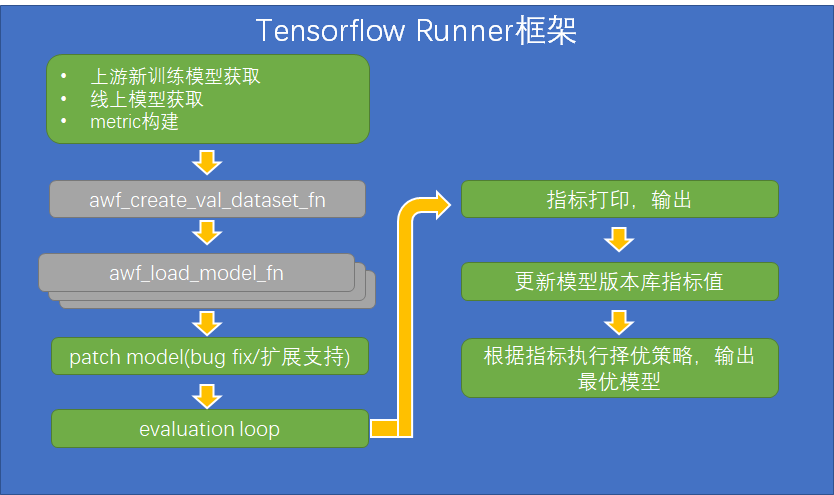

  
  
[[toc]]  
  
runner封装是内部采用tensorflow keras api封装了所有分布式训练细节，用户不再需要对代码做任何分布式改造。只需要定义好自己的模型结构及数据解析逻辑即可。模型结构和数据解析逻辑都通过预定义回调函数定义，用户实现回调函数即可。  
runner封装的**模型训练流程**如下图所示，** /其中绿色模块是框架功能，灰色模块是需要用户实现的部分/ **：  
  
**模型评估流程**如下图：  
  
# 一.回调函数  
## `awf_create_model_fn`  
- 是否必须实现：是  
- 说明：该回调函数用于创建模型对象，其必须返回一个tf.keras.Model对象作为用户要训练的模型，入参名字及取值由训练任务配置中**model_args**字段指定，任务配置说明见 http://tapd.oa.com/kubeflow/markdown_wikis/show/#1220424693001722117@toc4 。返回tf.keras.Model对象可以通过子类化tf.keras.Model类、sequential api、functional api几种方式定义。  
- 示例：下面示例使用functional api定义一个mlp model：  
  
```   
def awf_create_model_fn(name, input_size, layers):  
    inputs = tf.keras.Input(shape=(input_size,), name='input')  
    x = inputs  
    for i, layer_size in enumerate(layers):  
        x = tf.keras.layers.Dense(layer_size, activation='relu', name='layer_{}'.format(i))(x)  
    outputs = tf.keras.layers.Dense(1, name='output', activation='sigmoid')(x)  
    return tf.keras.Model(inputs=inputs, outputs=outputs, name=name)  
```  
假设model_args配置为：  
  
```   
{  
    "name": "mlp_model",  
    "input_size": 128,  
    "layers": [64, 32, 16]  
}  
```  
则将创建一个包含三个隐藏层的MLP模型，输入层为128维，三个隐藏层维度分别为64,32,16，输出层为1维。这里是把各层激活函数都写死了，实际使用也可以作为awf_create_model_fn参数传入。  
  
## `awf_create_train_dataset_fn`  
- 是否必须实现：包含训练任务时必须实现  
- 说明：该回调函数用于创建训练数据集，其必须返回一个tf.data.Dataset对象，入参名字及取值由训练任务配置中**train_data_args**字段指定，任务配置说明见 http://tapd.oa.com/kubeflow/markdown_wikis/show/#1220424693001722117@toc4 。  
- 示例：下面示例是从一个csv文件读取数据：  
  
```   
def awf_create_train_dataset_fn(file, skip_head, dim):  
    def __parse_single_data(line):  
        default_vals = [[0.]] * dim  
        parsed_line = tf.io.decode_csv(line, default_vals, field_delim=' ')  
        label = parsed_line[0]  
        feats = tf.concat(parsed_line[1:dim])  
        return feats, label  
  
    return tf.data.TextLineDataset(file.strip())\  
        .skip(1 if skip_head else 0)\  
        .map(__parse_single_data)  
```  
这里需要注意的是，返回的dataset每个record可以包含两个或者三个部分，第一个部分是输入特征，第二个部分是标签，第三个部分是样本权重（可选）  
 *!!#9900ff 另外这里有个小技巧，上面示例中，dataset是不能做batch的，因为分布式情况下，batch size与单机情况有些不一样，框架内部会自动做batch。但是先map在batch的情况下，数据输入的效率是不高的，如果先batch再map则效率会高很多，所以这个函数支持一个batch_size注入参数，及如果awf_create_train_dataset_fn函数的定义中包含了batch_size参数，则框架会自动将这个参数设置为合适的batch size大小，这样用户在实现这个函数时就是先batch再map从而提升数据输入效率，下面是添加了batch_size注入参数的示例!!* ：  
  
```   
def awf_create_train_dataset_fn(file, skip_head, dim, batch_size):  
    def __parse_single_data(line):  
        default_vals = [[0.]] * dim  
        parsed_line = tf.io.decode_csv(line, default_vals, field_delim=' ')  
        label = tf.expand_dims(parsed_line[0], axis=1)  
        feats = tf.stack(parsed_line[1:dim], axis=1)  
        return feats, label  
  
    return tf.data.TextLineDataset(file.strip())\  
        .skip(1 if skip_head else 0).batch(batch_size, True).\  
        .map(__parse_single_data)  
```  
  
假设train_data_args配置为：  
  
```   
{  
    "file": "${DATA_PATH}$/train.csv",  
    "skip_head": true,  
    "feat_num": 129  
}  
```  
则表示目录的train.csv文件中，解析时需要过滤文件头部第一行，特征维度有128维，标签维度为1维。  
## `awf_create_val_dataset_fn`  
- 是否必须实现：否  
- 说明：该回调函数用于创建测试数据集，即用于每个训练epoch结束后的测试数据，其必须返回一个tf.data.Dataset对象，入参名字及取值由训练任务配置中**val_data_args**字段指定，任务配置说明见 http://tapd.oa.com/kubeflow/markdown_wikis/show/#1220424693001722117@toc4。如果没有实现这个回调，则训练过程忽略测试步骤。  
- 示例，与awf_create_train_dataset_fn类似，参考awf_create_train_dataset_fn即可。  
## `awf_create_test_dataset_fn`  
- 是否必须实现：如果包含模型评估任务，则必须实现；否则可以不实现  
- 说明：该回调函数用于创建评估数据集，其返回值可以是单个tf.data.Dataset，也可以是多个tf.data.Dataset的tuple或dict。当返回单个Dataset时与awf_create_train_dataset_fn及awf_create_val_dataset_fn类似；而返回多个Dataset是用于一些特殊场景。例如某个场景中，label取值有0,1,2,3四种，然后需要对label做不同取值划分再计算auc metric，比如一种划分是label=0是负样本，而1,2,3都是正样本；另一种划分是0,1,2都是负样本，3是正样本，这样同一个对评估数据文件就产生了两个数据集，可以分别计算不同label划分方式下的auc（对于每个metric，每个Dataset会产生一个值）。返回tuple和dict的区别在于前者产生的metric名字是auc(0)、auc(1)，其中括号中的是Dataset的序号；而后者产生的metric名字是auc(key1), auc(key2)，其中括号中的Dataset对应的key。**!!#ff00ff 需要注意的当返回多个Dataset时，所有Dataset的结构和维度必须是一样的。!!**入参名字及取值由评估任务配置中**test_data_args**字段指定，任务配置说明见 http://tapd.oa.com/kubeflow/markdown_wikis/show/#1220424693001722117@toc6 。  
- 示例，以下示例以tuple形式返回两个Dataset：  
  
```   
def awf_create_test_dataset_fn(file, skip_head, dim):  
    def __parse_single_data(line, label_thresh):  
        default_vals = [[0.]] * dim  
        parsed_line = tf.io.decode_csv(line, default_vals, field_delim=' ')  
        label = tf.expand_dims(parsed_line[0], -1)  
        feats = parsed_line[1:dim]  
        return feats, tf.cast(label>label_thresh, tf.int32), None  
    return tf.data.TextLineDataset(file.strip()).skip(1 if skip_head else 0).map(lambda l: __parse_single_data(l, 0)), \  
        tf.data.TextLineDataset(file.strip()).skip(1 if skip_head else 0).map(lambda l: __parse_single_data(l, 2))  
          
```  
## `awf_create_predict_dataset_fn`  
- 是否必须实现：如果包含模型离线预测任务，则必须实现；否则可以不实现  
- 说明：用于创建离线预测数据集，数据集中应该只有特征列，!!#cc0000 **不包含label列**!!。其他与awf_create_val_dataset_fn一致。  
## `awf_model_to_save_fn`  
- 是否必须实现：否  
- 说明：该回调函数用于指定训练完要保存的模型对象，其也必须返回一个tf.keras.Model对象，如果不实现此函数，则默认保存的对象就是awf_create_model_fn函数返回的模型对象。对于一些特殊场景，要保存的模型可能只是训练模型的一部分，例如ranknet模型，训练模型是外层ranknet，而线上预测需要的模型只是内部的打分模型ranker。这时就需要实现此函数返回内部的子模型。该函数的入参是训练模型，即awf_create_model_fn函数返回的模型对象。  
- 示例：  
  
```   
def awf_model_to_save_fn(trained_model):  
    return trained_model.ranker  
```  
## `awf_load_model_fn`  
- 是否必须实现：否  
- 说明：该回调函数用于从指定模型路径和模型名称加在模型对象，在模型评估任务中使用。其必须返回一个tf.keras.Model对象，如果不实现此函数，则框架内部自动使用模型路径加载模型。该函数的入参有path和name两个，被调用时path和name的值来自于评估任务配置中的models字段，任务配置说明见 http://tapd.oa.com/kubeflow/markdown_wikis/show/#1220424693001722117@toc6 。  
- 示例：  
  
```   
def awf_load_model_fn(path, name):  
    return tf.keras.models.load_model(path)  
```  
实际上没有什么特殊处理的话，上面函数可以不实现。  
  
## `awf_group_trainable_vars_fn`  
是否必须实现：否  
说明：主要用于单模型多优化器的场景，用于对可训练参数集分组，返回一个tuple，tuple中每一个元素是一个可训练参数集合，注意返回的参数集合是与训练配置中的optimizer数组一一对应的，即第一个参数集合使用optimizer数组中的第一个优化器优化，第二个参数集合用第二个优化器优化，以此类推。optimizer的说明见http://tapd.oa.com/kubeflow/markdown_wikis/show/#1220424693001722117@toc5 ，  
示例：  
  
```   
def awf_group_trainable_vars_fn(model: WideDeepModel):  
    # model.linear_model.trainable_variables使用第一个优化器，model.dnn_model.trainable_variables使用第二个优化器  
    return model.linear_model.trainable_variables, model.dnn_model.trainable_variables  
```  
多优化器使用的完整示例见http://tapd.oa.com/kubeflow/markdown_wikis/show/#1220424693001774775@toc0  
  
# 二.完整示例  
  
```   
import tensorflow as tf  
  
  
class RankNetModel(tf.keras.Model):  
    def __init__(self, name, input_size):  
        super(RankNetModel, self).__init__(name=name)  
  
        self.ranker = self.create_ranker(name+"_rank_model", input_size)  
  
    @staticmethod  
    def create_ranker(name, input_size):  
        inputs = tf.keras.Input(shape=(input_size,), name='digits')  
        x1 = tf.keras.layers.Dense(64, kernel_regularizer=tf.keras.regularizers.l2(0.01), activation='relu',  
                                   name='dense_1')(inputs)  # relu  selu  
        x2 = tf.keras.layers.Dense(32, kernel_regularizer=tf.keras.regularizers.l2(0.01), activation='relu',  
                                   name='dense_2')(x1)  # relu  selu  
        x3 = tf.keras.layers.Dense(16, kernel_regularizer=tf.keras.regularizers.l2(0.01), activation='relu',  
                                   name='dense_3')(x2)  
        x4 = tf.keras.layers.Dense(16, kernel_regularizer=tf.keras.regularizers.l2(0.01), name='residual_dense_4')(  
            tf.concat([x1, x2, x3], axis=1))  
  
        z1 = tf.keras.layers.Dropout(0.5, name='dropout_r')(inputs)  
        z2 = tf.keras.layers.Dense(64, kernel_regularizer=tf.keras.regularizers.l2(0.01), activation='relu',  
                                   name='dense_r1')(z1)  # relu  selu  
        z3 = tf.keras.layers.Dense(32, kernel_regularizer=tf.keras.regularizers.l2(0.01), activation='relu',  
                                   name='dense_r2')(z2)  # relu  selu  
        z4 = tf.keras.layers.Dense(16, kernel_regularizer=tf.keras.regularizers.l2(0.01), activation='relu',  
                                   name='dense_r3')(z3)  
        z5 = tf.keras.layers.Dense(16, kernel_regularizer=tf.keras.regularizers.l2(0.01), name='residual_dense_r4')(  
            tf.concat([z1, z2, z3, z4], axis=1))  
  
        w = tf.keras.layers.Dropout(0.5, name='dropout')(tf.concat([x4, z5], axis=1))  
        outputs = tf.keras.layers.Dense(1, kernel_regularizer=tf.keras.regularizers.l2(0.01), name='predictions')(w)  
        # self.model.add(tf.keras.layers.Dense(1, activation='sigmoid'))  
        model = tf.keras.Model(inputs=inputs, outputs=outputs, name=name)  
        return model  
  
    @tf.function  
    def call(self, inputs, training=None, mask=None):  
        x_1 = inputs[2]  
        x_2 = inputs[3]  
        rank_1 = self.ranker(x_1, training=training)  
        rank_2 = self.ranker(x_2, training=training)  
        pred = tf.nn.sigmoid(rank_1 - rank_2)  
        return pred  
  
  
def awf_create_model_fn(name, input_size):  
    return RankNetModel(name, input_size)  
  
  
def __create_paired_dataset(file, feat_num, filt_num, batch_size):  
    def __parse_paired_data(line):  
        default_vals = [['0'], ['0'], [0.]] + [[0.]] * feat_num + \  
                       [['0'], ['0'], [0.]] + [[0.]] * feat_num + [0.]  
        parsed_line = tf.io.decode_csv(line, default_vals, field_delim=' ')  
        preidx_p1 = tf.stack(parsed_line[:2], axis=1)  
        feas_p1 = tf.stack(parsed_line[3: 3 + feat_num - filt_num], axis=1)  
        preidx_p2 = tf.stack(parsed_line[3 + feat_num: 3 + feat_num + 2], axis=1)  
        feas_p2 = tf.stack(parsed_line[3 + feat_num + 3: 3 + feat_num + 3 + feat_num - filt_num], axis=1)  
        label = tf.expand_dims(parsed_line[-1], axis=1)  
        weis = tf.expand_dims((parsed_line[2] - parsed_line[3 + feat_num + 2]) * parsed_line[-1], axis=1)  
        return (preidx_p1, preidx_p2, feas_p1, feas_p2), (label+1)/2, weis  
  
    return tf.data.TextLineDataset(file.strip()).skip(1).batch(batch_size, True)\  
        .map(__parse_paired_data)  
  
  
def __create_single_dataset(file, feat_num, filt_num, batch_size, like_listen=False):  
    def __parse_single_data(line):  
        default_vals = [['0'], ['0'], [0]] + [[0.]] * feat_num  
        parsed_line = tf.io.decode_csv(line, default_vals, field_delim=' ')  
        preidx = tf.expand_dims(parsed_line[0], axis=1)  
        label = tf.expand_dims(parsed_line[2], axis=1)  
        feas = tf.stack(parsed_line[3: 3 + feat_num - filt_num], axis=1)  
  
        if not like_listen:  
            label2_mask = tf.cast(label == 2, tf.int32)  
            label = label-label2_mask  
            label_1_mask = tf.cast(label == -1, tf.int32)  
            label = label + label_1_mask  
        else:  
            label_mask = tf.cast(label > 0, tf.int32)  
            label = label-label_mask  
  
        return (preidx, feas), label  
  
    def __filter_neg_label(line):  
        default_vals = [['0'], ['0'], [0]] + [[0.]] * feat_num  
        parsed_line = tf.io.decode_csv(line, default_vals, field_delim=' ')  
        label = int(parsed_line[2])  
        return label > 0  
  
    if not like_listen:  
        return tf.data.TextLineDataset(file.strip()).skip(1).batch(batch_size, True).map(__parse_single_data)  
    return tf.data.TextLineDataset(file.strip()).skip(1).filter(__filter_neg_label).batch(batch_size)\  
        .map(__parse_single_data)  
  
  
def awf_create_train_dataset_fn(file, feat_num, filt_num, batch_size):  
    return __create_paired_dataset(file, feat_num, filt_num, batch_size)  
  
  
def awf_create_test_dataset_fn(file, feat_num, filt_num, batch_size):  
    return __create_paired_dataset(file, feat_num, filt_num, batch_size)  
  
  
def awf_create_val_dataset_fn(file, feat_num, filt_num, batch_size):  
    return __create_single_dataset(file, feat_num, filt_num, batch_size, False), \  
           __create_single_dataset(file, feat_num, filt_num, batch_size, True)  
  
  
def awf_model_to_save_fn(trained_model: RankNetModel):  
    return trained_model.ranker  
  
```  
  
  
