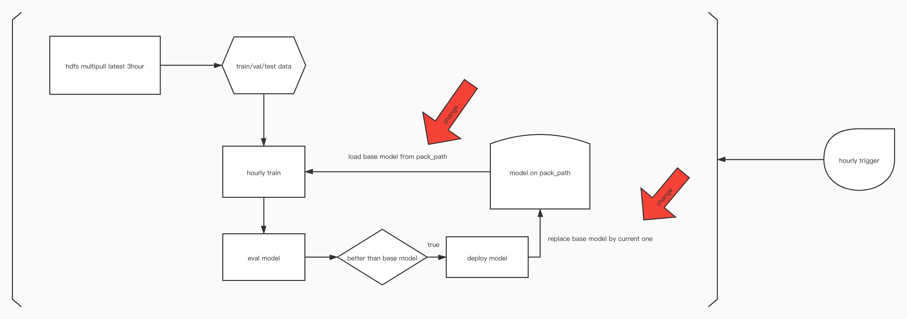
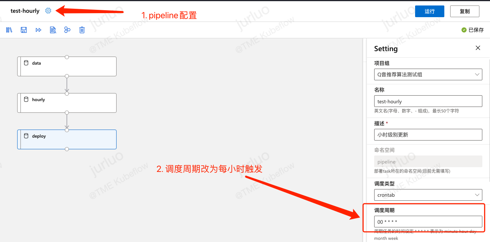
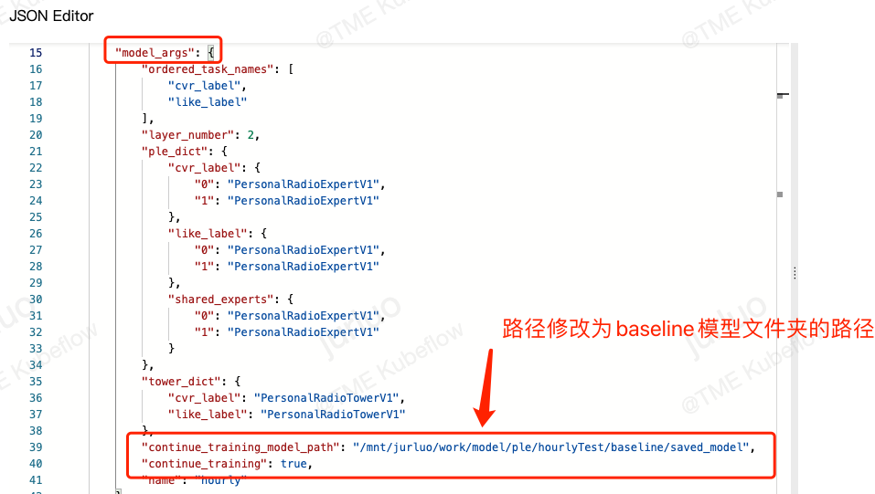
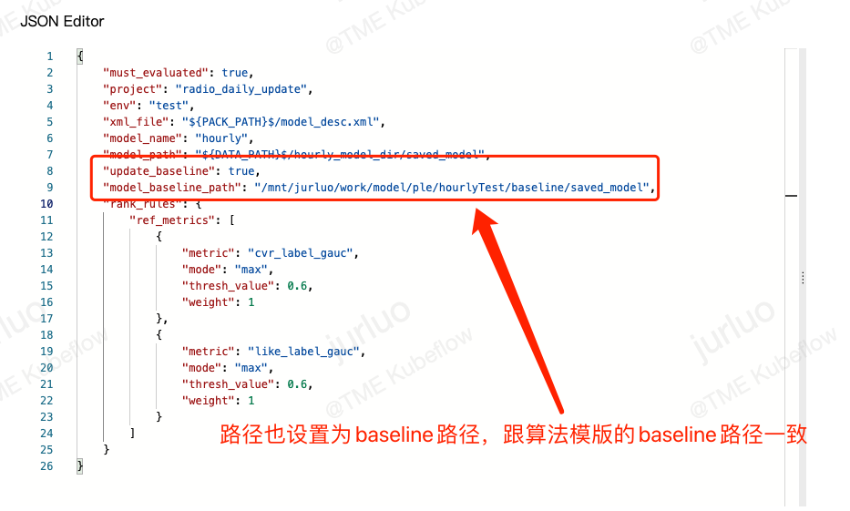

# 1 概述  
算法模版默认的训练模式是每次根据当前的数据从零开始训练模型，现在!!#ff0000 所有的算法模版!!都支持增量训练（每次在历史最优模型的基础上进行训练）。以增量训练的模式实现!!#ff0000 小时级甚至分钟级!!更新模型，达到接近实时训练的效果。从之前的全量训练模式迁移到增量训练模式的成本几乎可以忽略不计。  
# 2 训练流程  
  
## 2.1 核心步骤  
- [ ]  1. 训练数据从以天为单位改为以小时为单位进行落库（具体采样策略业务方自行决策）  
- [ ]  2. 小时级触发训练任务，依赖上游小时级数据产出任务  
  
- [ ]  3. 先准备好一个用全量数据在机器学习平台上训练出来的baseline模型，并且放到一个专门的目录，以后不要删除！！！（如果没有也可以。如果没有准备这一步骤，那么首次训练会从零开始训练。baseline模型训练数据较少可能会影响效果，建议进行这一步骤）  
- [ ]  4. 修改算法模版的参数，在model_args里面添加如下两个参数：  
  
- [ ]  5. 修改模型部署模版的参数，在最外层的json map里面添加如下两个参数：  
  
- [ ]  6. 数据拉取组件也做对应的更改（天 -> 小时）  
  
# 3 实现原理  
1. 如果是首次训练且没有预训练好的baseline，那么就会从头开始训练  
2. 否则每次训练都从baseline加载  
3. 更新baseline的时机与模型部署强绑定，如果这次训练的模型符合上线标准，那么在部署模型之后会对baseline进行更新，保证baseline与线上模型对齐。  
  
# 4 小时级+天级同时更新pipeline  
如果想多一重保障可以考虑设置两个增量更新模型的pipeline，baseline和serving的模型都对应同一个，一个pipeline小时级别更新，一个pipeline天级别更新，baseline地址都一致。这样如果小时级别更新引起模型效果下降的时候，天级别更新的模型会对baseline进行调整，保障模型效果的稳定  
# 5 TODO  
- [ ]  1. 增量更新状况企业微信同步  
- [ ]  2. 模型指标实时评估与告警